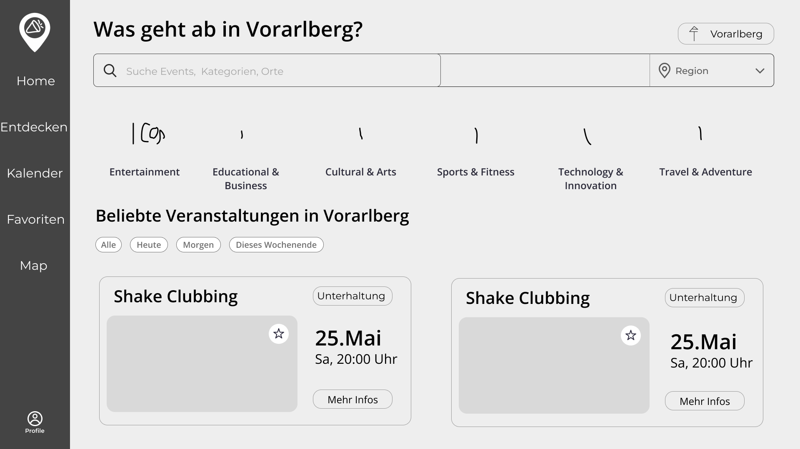
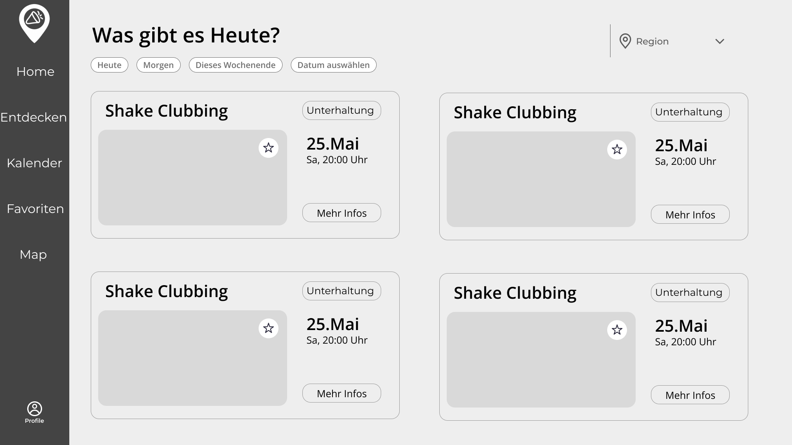
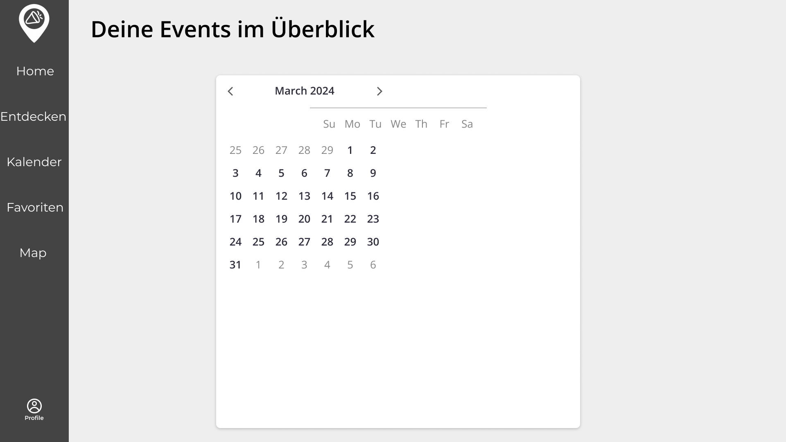
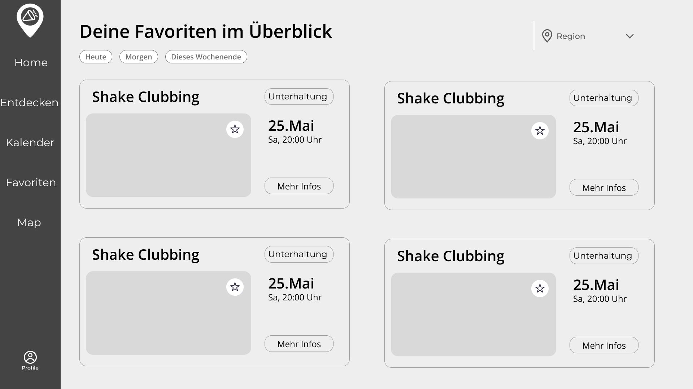
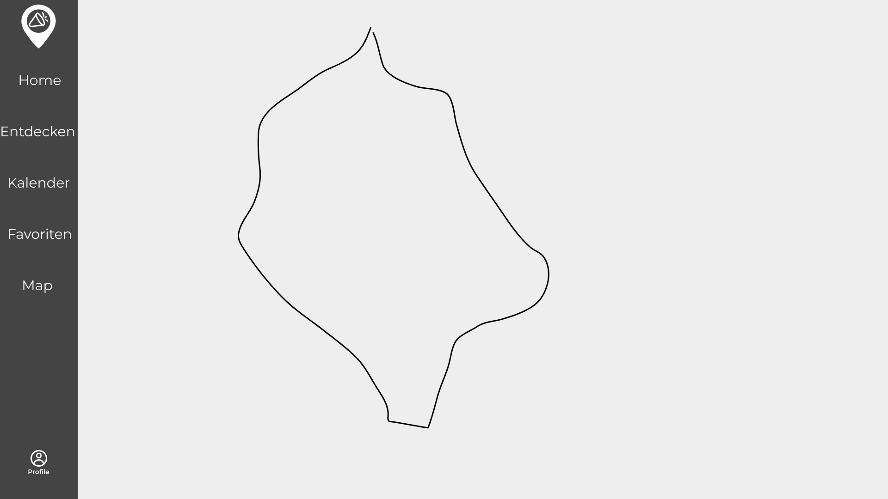
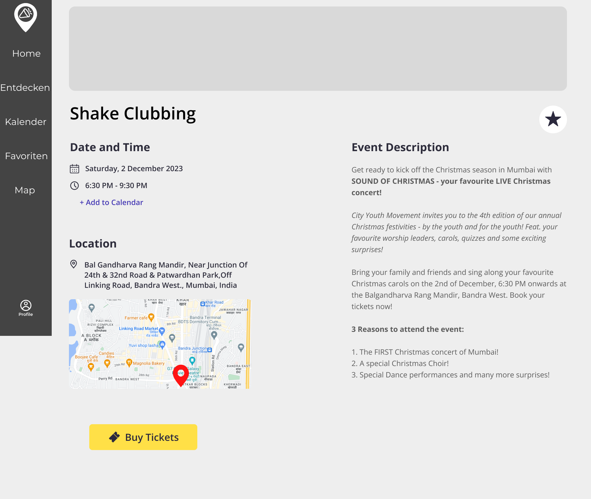
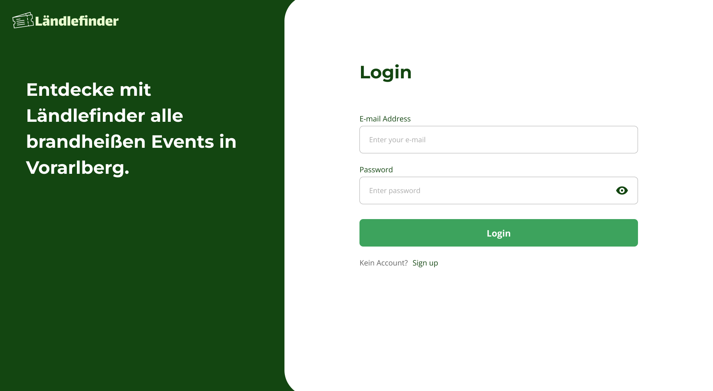
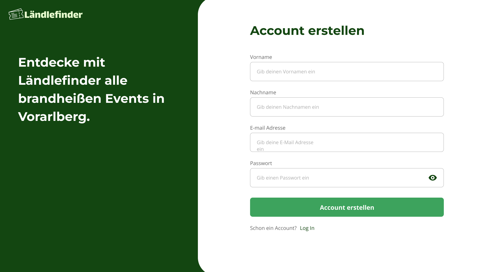

# Lastenheft (Rohat, Joudi, Florian):
 <h4>Events aus Vorarlberg auf einer Plattform präsentieren</h4>

## Idee:
    Eine App, die es ermöglicht, Events in Vorarlberg zu finden. Die App soll eine einfache und
    benutzerfreundliche Oberfläche haben, die es den Nutzern ermöglicht, nach Veranstaltungen in ihrer Nähe zu
    suchen. Die App soll auch eine Kartenansicht bieten, um die Standorte der Veranstaltungen anzuzeigen. Die
    App soll eine Filterfunktion haben, um die Suche nach bestimmten Arten von Veranstaltungen zu erleichtern.
    Die App soll auch eine Funktion haben, um Veranstaltungen zu speichern und später darauf zuzugreifen.

## Mindestanforderungen:
- Events anzeigen lassen
- Events filtern
- Kategorien
- Multiuser-Unterstützung
- Weg zum Wunschort (Adresse) anzeigen
- SQL-Datenbank

## Nice-To-Have:
- Handy-App
- Heatmap für Events
- Events in Umgebung anzeigen (außerhalb Vorarlberg)
- Event-Ort verlinken (z.B. Konzert-Tickets kaufen)

## Umsetzung:
- WPF als Grafisches Framework
- Datenbank in Cloud
- REST API für Kommunikation zwischen Frontend & Backend
- Swagger für REST API
- GitHub Project als management Tool
- GitHub als Repo speicher
- Google Maps API / OpenStreetMaps als Geografische Anzeige
- Nach Grundfunktionen => Multiuser Support und Filtern nach Kategorien
- Falls genügend Zeit:
    - Handy-App
    - Heatmap für Events

## Einteilung:
<b>Rohat</b>
- Swagger Grundaufbau
- Main Page
- Login Page
- Explore Page
- Design
- User Control Design
- Dokumentation

<b>Joudi</b>
- Swagger Grundaufbau
- Events filtern
- Register Page
- Profile Page
- Favorites Page
- Dokumentation

<b>Florian</b>
- Event API Integration
- Map Page
- Main Page
- Event User Control
- Dokumentation

## Skitzen & Klassendiagramme (Figma)
**Main Page**

**Explore Page**

**Kalender Page(Not Used)**

**Favorites Page**

**Map Page**

**Event Info**

**Login Page**

**Register Page**
