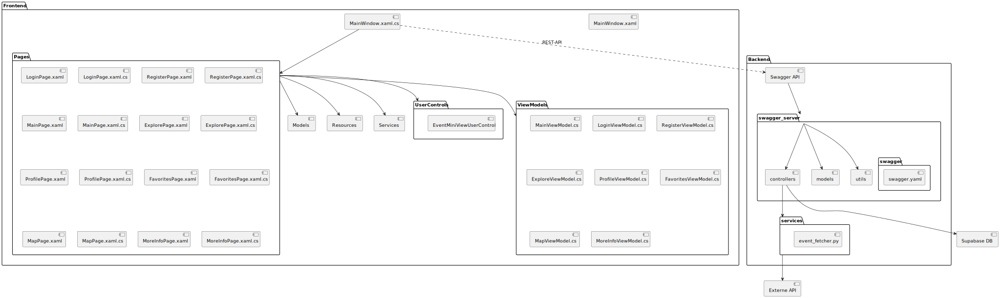

# Pflichtenheft (Rohat, Joudi, Florian)

## Softwarevoraussetzungen 
- .Net (8.0)
- Serilog (4.3.0)
- Serilog.Sinks.Console (6.0.0)
- Serilog.Sinks.File (7.0.0)
- ExtendedWPFToolkit (4.7.25)
- Mapsui3.UI.Wpf (3.0.0)
- MicrosoftWeb.WebView2 (1.0.33)
- PresentationFramework (4.6.0)
- PresentationFramework (1.0.1)
- SharpVectors.Reloaded (1.8.4.2)
- SharpVectors.Wpf (1.8.4.2)
- SkiaSharp.Views.WPF (3.119.0)

## Funktionsblockdiagramm (von ChatGPT erklärt)

## Detaillierte Beschreibung
  Wenn man das Programm startet, sieht man zuerst den Login Screen, solange man einen Account hat, kann man direkt loslegen. Wenn nicht, kann man sich Registrieren, die Registration benötigt den Vor- und Nachnamen, die email und ein Passwort.
   

  Nun kommt man auf den Homescreen in welchem, die Events präsentiert werden. Mit der Suchzeilekönnen die Events nach Kategorie, Name und anderen Attributen gefiltert werden. Das Programm im generellen wird durch die Sidebar gesteuert, welche sich an der linken Seite des Bildschirms befindet.
   

  Auf den Event Objekten befindet sich der Titel, ein Bild, ein Knopf zum Favorisieren, das Datum, die Uhrzeit, und der Button zur Detailansicht.
   

  In der Detailansicht befindet sich, neben den schon genannten Dingen auch eine Karte, um genau zu wissen, wo sich das Event befindet, und noch eine Beschreibung, welche einem mehr über die Attraktion erzählt. Zudem gibt es auch, Eventabhängig, Ticketpreise.
   

  Auf der Entdecken Seite findet man Events, welche in den nächsten Tagen stattfinden werden. Die Entdecken Seite, ist gleich aufgebaut, wie die HomePage um eine vereinheitlichte Erfahrung zu schaffen.
   

  Unter Favoriten, findet man seine, userspezifische, Liste an Events. Um genau die zu finden, welche man besuchen möchte.
   

  Bei Map sieht man eine Karte, welche die genauen Standorte der Events beinhaltet um so zu sehen, was in der Umgebung so vor sich geht.
   

  Mit der Profil Seite kann man seine Nutzerdaten, nach belieben, anpassen und sich auch wieder Abmelden.

## Umsetzung
  Wir haben begonnen mit der Ideenfindung, nachdem wir unsere idee (Events in Vorarlberg finden) bekommen haben, fingen wir an das Design in Figma, sowie die Technologie, welche wir nutzen werden, zu bestimmen. Wir haben WPF als Framework genommen, da wir schon einige Erfahrung in WPF gesammelt haben und das den Prozess des Entwickelns, sowie der Fehlersuche erheblich vereinfachen würde. Für Supabase haben wir uns entschieden 1. da die Dokumentation gut war 2. die API verbindung zum Projekt nicht kompliziert war und 3. der Service, bis zu einem gewissen Zeitpunkt, gratis ist. Nachdem alle Technolgien ausgewählt worden sind, haben wir uns and das Backend gesetzt, hier haben wir uns für Swagger mit einem Python-Flask Webserver entschieden, da wir dank dem DBI Unterricht schon wussten wie das ganze funktioniert. Nachdem das Design bestimmt war, begann die Arbeit am Backend, da es den Zugang zur API noch nicht gab, lag der Fokus eher auf die Verbindung zwischen der Datenbank und dem Swagger Server sowie den Endpoints, welche benötigt werden. Gleichzeitig startete auch die Arbeit am Frontend Projekt, so gut wie es geht haben wir das Design, sowie den Grundaufbau der Pages gemacht, gleichzeitig implimentierten wir die Map, da diese nicht mit der Event API zusammenhing. Nachdem wir Zugang zur API bekommen haben. Haben wir die Daten aus der API gezogen und nun konnte die Entwicklung richtig beginnen. Nachdem wir alle Event daten bekamen setzten wir diese ein. Zum Schluss haben wir noch einige Verfeinerungen am Code, sowie dem Design gemacht und UnitTests und Logging eingebaut um den Code zu testen und zu debuggen.

## Probleme und Ihre Lösung
1. **Event-API**
    Problem:
        Wir haben keinen Zugang bekommen zu API und als wir den Zugang bekommen haben, war der durchblick nicht wirklich gegeben.
    Fix:
        Dank Herrn Nesensohn bekamen wir den Zugang zur API und Dank Herrn Bechtold konnten wir die JSON-Dumps analysieren und verarbeiten.

